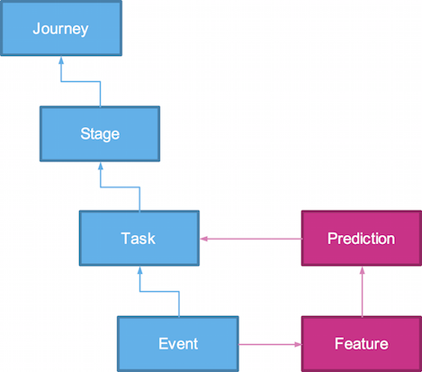

# Data-driven Customer Journey Mapping

## Definition of terms

<table>
    <tr>
        <th>Term
        <th>Description
        <th>Examples
    </tr>
    <tr>
        <td>Journey
        <td>
            
The process a customer navigates in relationship with an organisation to accomplish an objective. Customer journeys have a start and end, which may span days, weeks or months. Customer journeys are often unique but patterns can emerge, which can be used to define a class of customers. Journeys tell a story about what an entity experienced in reaching an end state. Big Data enables analysis of all experiences and the journeys they contain to ensure precision in analysis outcomes and the business decisions they drive. Example journeys include:
        </td>
        <td>
            <ul style="padding-left:5px">
                <li>Order to activation
                <li>Product purchase and post-purchase care
                <li>Complaint escalation
            </ul>
        </td>
    </tr>
    <tr>
        <td>Stage/Activity
        <td>
            
Common cross-channel behaviours in aggregate.
        </td>
        <td>
            <ul style="padding-left:5px">
                <li>Discover
                <li>Purchase
                <li>Setup
            </ul>
        </td>
    </tr>
    <tr>
        <td>Task
        <td>
            
A business defined task performed in a specific channel, perhaps using a specific device or technology. The general form of a specific interaction.
        </td>
        <td>
            <ul style="padding-left:5px">
                <li>Received notification with personalized offer
                <li>Get Help from Website
                <li>Add to cart
            </ul>
        </td>
    </tr>
    <tr>
        <td>Event/Interaction
        <td>
            
A raw event involving a specific entity and system.
        </td>
        <td>
            <ul style="padding-left:5px">
                <li>Called Contact Centre – Product enquiry
                <li>Email – Sent offer (Campaign ABC)
                <li>Live Chat – Offer enquiry
            </ul>
        </td>
    </tr>
    <tr>
        <td>Feature
        <td>
            
In machine learning and pattern recognition, a feature is an individual measurable property of a phenomenon being observed. Choosing informative, discriminating and independent features is a crucial step for effective algorithms in pattern recognition, classification and regression. The concept of "feature" is related to that of explanatory variable used in statistical techniques such as linear regression.
            
The initial set of raw features can be redundant and too large to be managed. Therefore, a preliminary step in many applications of machine learning and pattern recognition consists of selecting a subset of features, or constructing a new and reduced set of features to facilitate learning, and to improve generalization and interpretability.
            
Extracting or selecting features is a combination of art and science; developing systems to do so is known as feature engineering. It requires the experimentation of multiple possibilities and the combination of automated techniques with the intuition and knowledge of the domain expert. Automating this process is feature learning, where a machine not only uses features for learning, but learns the features itself.
        </td>
        <td>
            <ul style="padding-left:5px">
                <li>Regular video usage during a standard commute time
                <li>Increased use of international roaming
            </ul>
        </td>
    </tr>
</table>
        