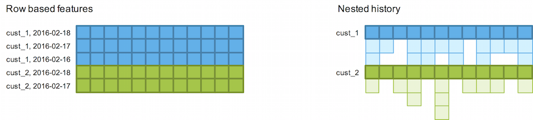

# Implementing a Reactive Pipeline

With a reactive data pipeline, data from source is "pulled through" a set of transformations to derive a feature, which may involve a machine learning model step (similar to how a spreadsheet recalculates after a cell change). Pipelines are defined through function decomposition instead of through orchestration. When new data becomes available, a message is published, which results in all features that are dependent on the new data to recalculate.

Parquet supports nested columns. Instead of storing history conceptually as rows, we can store the history of a given feature as a nested structure.

* Traditionally, using relational technology, change has been determined at the row level. With the addition or removal of columns (features), the history of all features in the row must be recalculated.
* Using a nested structure, history belongs to the individual feature. History doesn’t need to be recalculated at all if not required for the new feature.
