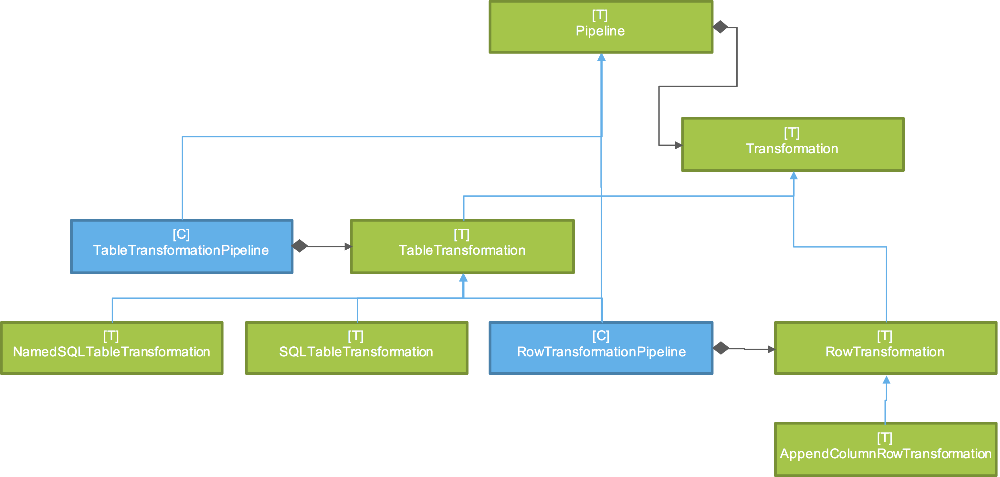

# Transformations

Building blocks and patterns for building data prep transformations and feature engineering in Spark.

This is not trying to be a "macro" workflow framework such as Oozie, Luigi or Azkaban, but a "micro" framework to better organize the code within a Spark App/Job.

The granularity of Spark Apps/Jobs might be driven by source feeds or scoring of a particular analytical model. Jobs should be designed to maximise parallel execution based on dependency constraints, where possible, instead of timed. However, each job may encompass multiple transformations that must be performed together because they form a logical unit of work. For example, all row-level transformations that operate on a particular dataset will be executed as a unit.

This framework provides support for organizing transformations as well as organizing features within flexible data structures that serve a shared feature store.

## Example

Convert from this
    
    schema
     |-- entityIdType: string (nullable = true)
     |-- entityId: string (nullable = true)
     |-- attribute: string (nullable = true)
     |-- ts: string (nullable = true)
     |-- value: string (nullable = true)
     |-- properties: string (nullable = true)
     |-- processTime: string (nullable = true)

    [607,2030076520,745,2013-01-29 00:00:00+10,1,15724,04:03.9]
    [607,2013046983,745,2013-01-24 00:00:00+10,1,15724,04:03.9]
    [607,2021006929,745,2013-01-31 00:00:00+10,1,15724,04:03.9]

to this

    schema
     |-- entityIdType: string (nullable = true)
     |-- entityId: string (nullable = true)
     |-- attribute: string (nullable = true)
     |-- ts: string (nullable = true)
     |-- value: string (nullable = true)
     |-- properties: string (nullable = true)
     |-- processTime: string (nullable = true)
     |-- column_7: integer (nullable = true)
     |-- column_8: integer (nullable = true)

    [607,2030076520,Hello World 745,2013-01-29 00:00:00+10,1,15724,04:03.9,50,55]
    [607,2013046983,Hello World 745,2013-01-24 00:00:00+10,1,15724,04:03.9,50,55]
    [607,2021006929,Hello World 745,2013-01-31 00:00:00+10,1,15724,04:03.9,50,55]

by constructing the following pipeline of transformations

      +-----+ 
      |World| 
      +-----+ 
         |    
         v    
      +-----+ 
      |Hello| 
      +-----+ 
         |    
         v    
      +-----+ 
      |Fifty| 
      +-----+ 
         |    
         v    
     +-------+
     |AddFive|
     +-------+

* [World] - Prepends the text "World" to field 3
* [Hello] - Prepends the text "Hello" to field 3
* [Fifty] - Appends a new column (column_7) with the value 50
* [AddFive] - Appends a new column (column_8) with the value of 5 added to column_7

The transformations must be performed in the appropriate sequence as show above.

    val Transform = RowTransformation
    val AppendColumn = AppendColumnRowTransformation

    val FiftyTransform = AppendColumn(
        name = "Fifty",
        columnName = "column_7",
        dataType = IntegerType
      ) { (row, ctx) =>
        50
      }
      
    val AddFiveTransform = AppendColumn(
        name = "AddFive",
        columnName = "column_8",
        dataType = IntegerType
      ) { (row, ctx) =>
        row.getInt(7) + 5
      } addDependencies FiftyTransform
          
    import RowTransformation._

    val HelloTransform = Transform(
        name = "Hello"
      ) { (row, ctx) => {
        val f = fieldLocator(row, ctx)
        Row(
          f("entityIdType"),
          f("entityId"),
          s"Hello ${f("attribute")}",
          f("ts"),
          f("value"),
          f("properties"),
          f("processTime")
        )
      }}
      
    val pipeline = new RowTransformationPipeline("test")
    
    FiftyTransform.addDependencies(HelloTransform)
    
    pipeline.addTransformations(AddFiveTransform, HelloTransform, FiftyTransform)
    
    val ctx = new TransformationContext
    ctx(SCHEMA_KEY, rawDF.schema)
    
    // execute the pipeline
    val results = pipeline(rawDF, ctx)

With Sources and Sinks

    val source = CSVSource(sqlContext)
    val sink = CSVSink(sqlContext)
    
    val path = "/tmp/events_sample.csv").getPath

    // Set params in the TransformationContext
    ctx("in_path", path)
    ctx("schema", inputSchema)
    ctx("out_path", "/tmp/workflow_spec_out_csv")

    val results = pipeline.run(source, sink, ctx)

Organizing SQL

sql.properties

    query1 = select attribute, ts, value from events where attribute = '745'
    query2 = select attribute, ts, value from events where entityId = '2017512160'

Alternatively, sql.xml

    <?xml version="1.0" encoding="UTF-8"?>
    <!DOCTYPE properties SYSTEM "http://java.sun.com/dtd/properties.dtd">
    <properties>
        <comment>Test queries</comment>
        <entry key="query1">select attribute, ts, value from events where attribute = '745'</entry>
        <entry key="query2">select attribute, ts, value from events where entityId = '2017512160'</entry>
    </properties>

In code

    val transform = new NamedSQLTransformation("<path-to>/sql.properties", "query1")
    
    val results = transform(sqlContext)

    val transform2 = new NamedSQLTransformation("<path-to>/sql.xml", "query1")
    
    val results2 = transform2(sqlContext)

### Pivot functions

Setup

    import diamond.transformation.PivotFunctions._
    import diamond.transformation.functions._
    import diamond.models.AttributeType._
    
    val cal = Calendar.getInstance()

    val events: RDD[Event] = rawDF.map { row =>
      Event(
        hashKey(row.getAs[String]("entityIdType") + row.getAs[String]("entityId")),
        row.getAs[String]("attribute"),
        convertStringToDate(row.getAs[String]("ts"), "yyyy-MM-dd"),
        "test",
        row.getAs[String]("value"),
        row.getAs[String]("properties"),
        "events_sample.csv",
        "test",
        cal.getTime,
        1
      )
    }

Register features of interest

    val store = new FeatureStore
    store.registerFeature(Feature("745", Base, "test", "string", "Attribute 745", active = true))

Create snapshot view of registered, active features as of today

    val snap = snapshot(events, cal.getTime, store)

Sample result

    <hashed entity id>, <value of feature 745>
    94ceafdc4934653fa176f9ba16b5f68beec12f1d15828d279cdcf8857936acd1, 1
    b4eded69703cedeecfa3c9750af235c5ce79c401b593268fd34ed5a945a3e425, 1
    7f4eb0ae9276908c24a4a0d99e6d7f0cb801675e121f94b34ffaaa2caa39e4d8, 1
    f218f957e2dc6627c53288a2c88e4a06f5cf7c7b1383d3f9650895cf75b60cc2, 1
    fa7e062388a56e82cb9f515275f610c4b6b121b8b5004495be7a0ad799b676cd, 1

## Concepts

A Pipeline consists of one or more Transformations.

A [Pipeline](https://github.com/markmo/featurestore/blob/master/src/main/scala/diamond/transform/Pipeline.scala) can consist of:

* An optional Source
* One or more Transformations
* An optional Sink

The signatures of each are as follows:

__Source__

    def apply(ctx: TransformationContext): DataFrame
    
A [Source](https://github.com/markmo/featurestore/blob/master/src/main/scala/diamond/io/Source.scala) takes a [TransformationContext](https://github.com/markmo/featurestore/blob/master/src/main/scala/diamond/transform/TransformationContext.scala) and returns a [Spark DataFrame](http://spark.apache.org/docs/latest/api/scala/index.html#org.apache.spark.sql.DataFrame).

A [TransformationContext](https://github.com/markmo/featurestore/blob/master/src/main/scala/diamond/transform/TransformationContext.scala) is passed like a baton from one step of the Pipeline to the next. It is a hashmap of data, which supplies parameters as well as enabling data to be passed to future steps.

A DataFrame is a distributed collection of data organized into named columns. It is conceptually equivalent to a data frame in R/Python, but with richer optimizations under the hood. DataFrames can be constructed from a wide array of sources such as: structured data files, tables in Hive, external databases, or existing RDDs.
    
__Sink__

    def apply(df: DataFrame, ctx: TransformationContext): DataFrame

A [Sink](https://github.com/markmo/featurestore/blob/master/src/main/scala/diamond/io/Sink.scala) takes a DataFrame and TransformationContext, persists the data to storage, and returns the DataFrame.
    
__TableTransformation__

    def apply(df: DataFrame, ctx: TransformationContext): DataFrame

A [TableTransformation](https://github.com/markmo/featurestore/blob/master/src/main/scala/diamond/transform/table/TableTransformation.scala) takes a DataFrame and TransformationContext, and returns a new transformed DataFrame.

__RowTransformation__

    def apply(row: Row, ctx: TransformationContext): Row

A [RowTransformation](https://github.com/markmo/featurestore/blob/master/src/main/scala/diamond/transform/row/RowTransformation.scala) takes a [Spark Row object](http://spark.apache.org/docs/latest/api/scala/index.html#org.apache.spark.sql.Row) and TransformationContext, and returns a new transformed Row.

Pipelines can be composed into larger pipelines.

## Documentation

The following template transformations exist.

Transformations may be applied at a per-row level or on the table as a whole, e.g. group-by aggregations.

Row-level transformations:

* [AppendColumnRowTransformation](https://github.com/markmo/featurestore/blob/master/src/main/scala/diamond/transform/row/AppendColumnRowTransformation.scala) - Appends a new column value to a row. Instead of implementing `apply`, the developer implements `append`, which returns the new value. The value may be calculated with reference to any other value in the Row or to the TransformationContext.
* [RowTransformation](https://github.com/markmo/featurestore/blob/master/src/main/scala/diamond/transform/row/RowTransformation.scala) - A general row transformation that takes a Row and returns a new Row. The new Row may conform to a different schema. The new Row may be computed with reference to any values in the original Row or to any values in the TransformationContext.

Table-level transformations:

* [NamedSQLTableTransformation](https://github.com/markmo/featurestore/blob/master/src/main/scala/diamond/transform/table/NamedSQLTableTransformation.scala) - Uses Spark SQL given a named query (queryName) from a configuration file (propsPath) to construct a new DataFrame. The new DataFrame may be computed with reference to the existing DataFrame, e.g. projection, and to any values in the TransformationContext.
* [SQLTableTransformation](https://github.com/markmo/featurestore/blob/master/src/main/scala/diamond/transform/table/SQLTableTransformation.scala) - Uses Spark SQL given a query string (sql) to construct a new DataFrame. The new DataFrame may be computed with reference to the existing DataFrame, e.g. projection, and to any values in the TransformationContext.
* [SQLFileTableTransformation](https://github.com/markmo/featurestore/blob/master/src/main/scala/diamond/transform/table/SQLFileTableTransformation.scala) - Uses Spark SQL given a SQL statement loaded from a configuration file (filename) to construct a new DataFrame. The new DataFrame may be computed with reference to the existing DataFrame, e.g. projection, and to any values in the TransformationContext.
* [TableTransformation](https://github.com/markmo/featurestore/blob/master/src/main/scala/diamond/transform/table/TableTransformation.scala) - A general table-level transformation that takes a DataFrame and returns a new DataFrame. The new DataFrame may conform to a different schema. It may be computed with reference to the original DataFrame or to any values in the TransformationContext.
* [RowTransformationPipeline](https://github.com/markmo/featurestore/blob/master/src/main/scala/diamond/transform/table/RowTransformationPipeline.scala) - A RowTransformationPipeline takes a DataFrame and applies a Pipeline of row-level transformations to return a new DataFrame. The supplied DataFrame and TransformationContext are provided as inputs to the Pipeline.

The following template Sources exist.

* [CSVSource](https://github.com/markmo/featurestore/blob/master/src/main/scala/diamond/io/Source.scala) - Loads a DataFrame from a CSV file.
* [ParquetSource](https://github.com/markmo/featurestore/blob/master/src/main/scala/diamond/io/Source.scala) - Loads a DataFrame from a Parquet file.
* [SQLSource](https://github.com/markmo/featurestore/blob/master/src/main/scala/diamond/io/Source.scala) - Loads a DataFrame using Spark SQL given a named query from a SQL configuration file.

Parquet is a columnar storage format available to any project in the Hadoop ecosystem, regardless of the choice of data processing framework, data model or programming language. Parquet is built from the ground up with complex nested data structures in mind, and uses the [record shredding and assembly algorithm](https://github.com/Parquet/parquet-mr/wiki/The-striping-and-assembly-algorithms-from-the-Dremel-paper) described in the Dremel paper.

The following template Sinks exist.

* [CSVSink](https://github.com/markmo/featurestore/blob/master/src/main/scala/diamond/io/Sink.scala) - Saves a DataFrame to a CSV file.
* [ParquetSink](https://github.com/markmo/featurestore/blob/master/src/main/scala/diamond/io/Sink.scala) - Saves a DataFrame to a Parquet file.

The following library functions exist.

* [convertStringToDate](https://github.com/markmo/featurestore/blob/master/src/main/scala/common/utility/dateFunctions.scala) - Converts a date string of a given pattern to a Date object.
* [formatDateString](https://github.com/markmo/featurestore/blob/master/src/main/scala/common/utility/dateFunctions.scala) - Formats a date string of a given pattern to a conformed format (yyyy-MM-dd).
* [formatDateTimeString](https://github.com/markmo/featurestore/blob/master/src/main/scala/common/utility/dateFunctions.scala) - Formats a date string of a given pattern to a conformed date and time format (yyyy-MM-dd HH:mm:ss).
* [convertStringToTimestamp](https://github.com/markmo/featurestore/blob/master/src/main/scala/common/utility/dateFunctions.scala) - Converts a date string of a given pattern to epoch (unix) time, defined as the number of seconds that have elapsed since 00:00:00 Coordinated Universal Time (UTC), Thursday, 1 January 1970, not counting leap seconds.
* [hashKey](https://github.com/markmo/featurestore/blob/master/src/main/scala/common/utility/hashFunctions.scala) - Hashes a string key using SHA-256. Used to hash entity keys, which may be composite.
* [template](https://github.com/markmo/featurestore/blob/master/src/main/scala/common/utility/stringFunctions.scala) - Using the "pimp my library" pattern to render a string template substituting variables.
* [score](https://github.com/markmo/featurestore/blob/master/src/main/scala/common/utility/scoringFunctions.scala) - Score DataFrame using POJO model from H2O.

These functions may be accessed by including the following import statement.

    import diamond.transformation.functions._
